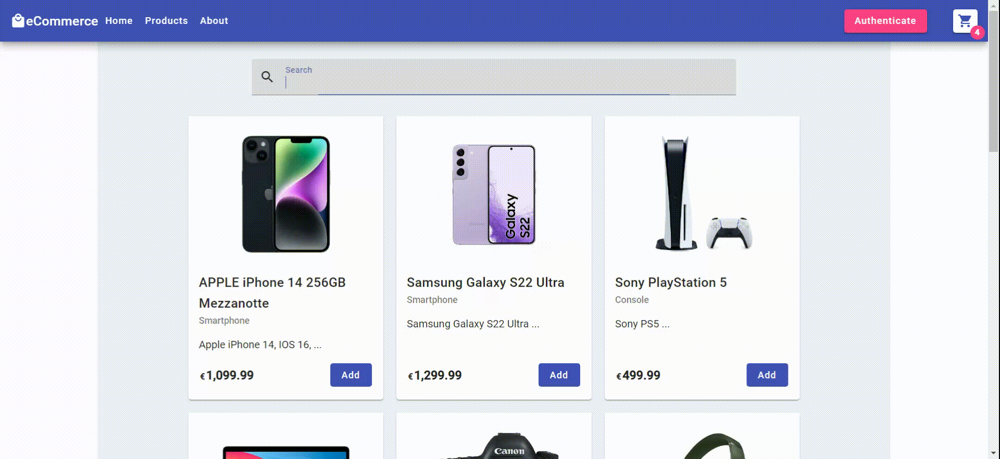
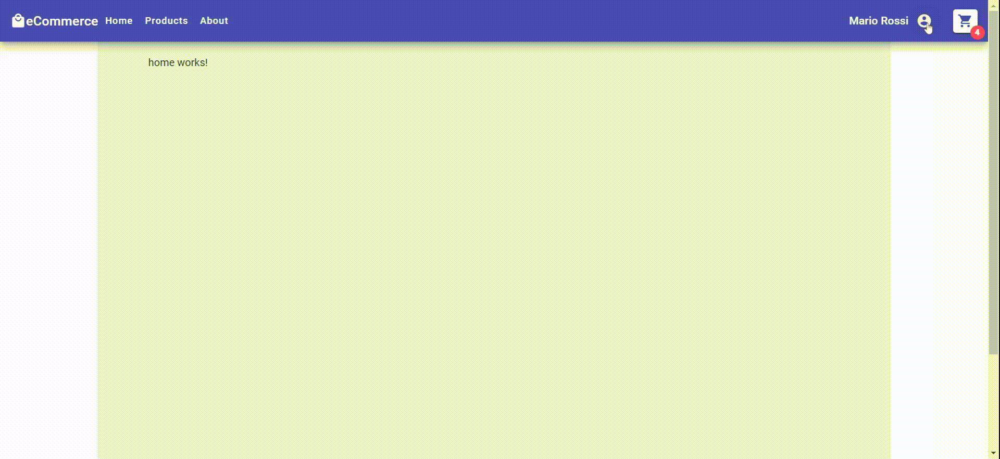
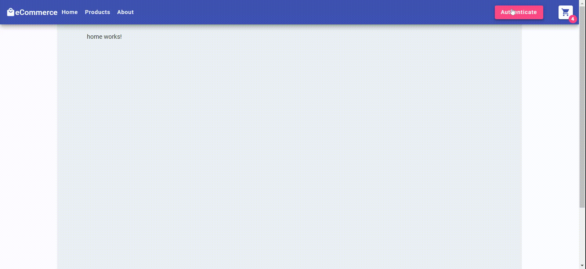

# Fullstack Ecommerce

This repository serves as a personal learning playground for exploring Angular (with Spring Boot + MySql).

## Overview

### Cart

### Products

### Search

### Profile

### Authentication

## Features
- Angular
- Spring Boot (JPA + MySql)
- **Persistent Cart with Local Storage**
- **JWT Authentication (local storage + authorization header)**
- Angular Material (Paginator, ErrorStateMatcher, ...)
- Reactive Forms
- Form Validators (built-in + custom)
- Guard
- Routing
- Interceptor
- Custom Directive
- Modules
- ChangeDetectionStrategy.OnPush
- RxJS
- Toggle Password Visibility
- Lazy Loading (lazy-loaded route)
- Content Projection
- ...

## Getting Started
### Angular
#### Prerequisite 
- Node.js
- Angular CLI
#### Installation
- Clone the repository
<pre><code> $ git clone https://github.com/stefanoandroni/fullstack-ecommerce  </code></pre>
- Install the project dependencies
<pre><code> $ npm install </code></pre>
- Start the development server
#### Run
<pre><code> $ ng serve </code></pre>
- Open your browser and navigate to http://localhost:4200/

### Spring Boot
#### Run
- run *src/backend/src/main/java/org/stand/springbootecommerce/SpringBootEcommerceApplication.java*

